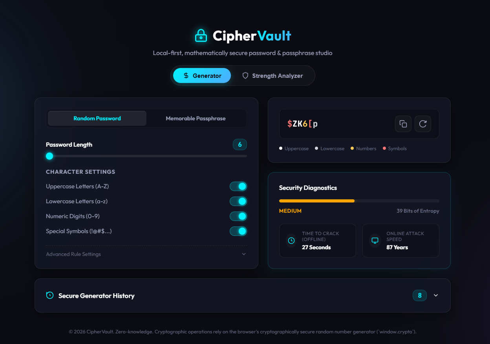
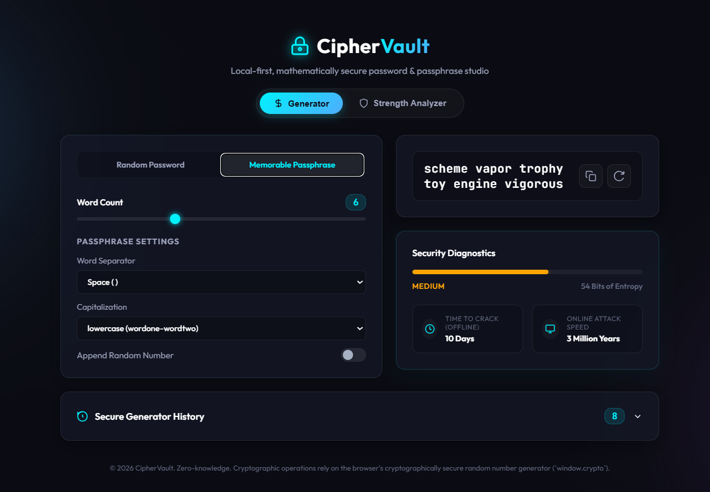
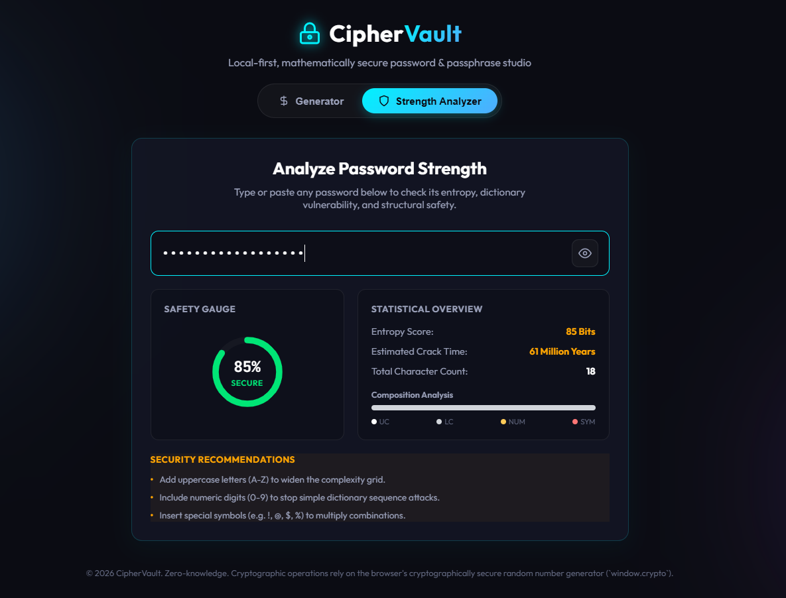

# 🛡️ CipherVault | Premium Password & Passphrase Studio

CipherVault is a visually stunning, mathematically secure, local-first single-page application for generating cryptographically secure passwords and memorable passphrases. Built with modern styling (glassmorphism, glowing micro-interactions, dark mode) and zero external dependencies, CipherVault performs all security computations directly in the user's browser for maximum privacy.


---


## ✨ Features

- 🎲 **Cryptographically Secure Randomness**: Relies on the browser's native `crypto.getRandomValues()` API (avoiding weak pseudo-random generation).
- 🔑 **Multiple Modes**:
  - **Random Password**: Granularly select uppercase, lowercase, numbers, and custom symbols pools.
  - **Memorable Passphrase**: Creates human-memorable combinations from a clean dictionary word list with customizable separators, capitalization styles, and numeric appends.
- 🔬 **Real-Time Security Diagnostics**:
  - **Shannon Entropy Calculation**: Computes exact mathematical strength ($H = L \times \log_2(N)$).
  - **Time-to-Crack Estimator**: Simulates both fast offline brute-force attacks ($10^{10}$ guesses/sec) and rate-limited online attacks.
- 📊 **Dynamic Character Highlighting**: Color-codes the password display to help users visually distinguish letters, numbers, and symbols instantly.
- 🛡️ **Built-in Strength Analyzer**: Type or paste any custom password to inspect its structural safety, character distribution percentage, and receive actionable tips to fix vulnerabilities.
- 🕵️ **Secure History Log**: Caches recently generated passwords in session memory (hidden/masked by default until hovered or clicked).
- 📱 **Premium Responsive UI**: Built with a modern glassmorphic dashboard design, glowing visual gauges, slide transitions, and optimized viewport rendering for desktop, tablet, and mobile.

---

## 📸 Screenshots

### 1. Cryptographically Secure Random Password Generation
Configure character pools, custom symbols, and easily exclude ambiguous similar characters (e.g. `i, l, 1, o, 0`) with live security assessments.


### 2. Memorable Passphrase Generator Mode
Generate memorable yet secure, dictionary-based passphrases with customized separators, Title Case formatting, and random digits.


### 3. Password Strength & Entropy Analyzer
Input any password to run entropy tests, measure composition percentages, and get immediate recommendations to strengthen it.


---

## 🛠️ Technology Stack

- **Structure**: Semantic [HTML5](index.html)
- **Styling**: Modern, responsive [CSS3](style.css) featuring:
  - Glassmorphic backdrop filters
  - Ambient radial gradients
  - Keyframe animations and transitions
  - Custom input sliders & switches
- **Logic**: Vanilla [JavaScript (ES6)](app.js) with zero dependencies.

---

## 🚀 Running Locally

### Prerequisites
- [Node.js](https://nodejs.org/) (for running a local HTTP server).

### Installation & Launch

1. Clone this repository:
   ```bash
   git clone https://github.com/your-username/password-generator.git
   cd password-generator
   ```

2. Start the local server:
   - **Using npm (Windows / macOS / Linux)**:
     ```bash
     npm run dev
     ```
   - **Bypassing PowerShell execution policies on Windows**:
     If you encounter execution policy errors in Windows PowerShell, run:
     ```powershell
     npm.cmd run dev
     ```
   - **Without Node.js / npm (Python fallback)**:
     ```bash
     python -m http.server 3000
     ```

3. Open your browser and navigate to:
   ```
   http://localhost:3000
   ```

---

## 🧠 Security & Mathematics

### Shannon Entropy Estimation
Entropy (in bits) defines the amount of uncertainty or randomness in a password. It is calculated using:
$$H = L \times \log_2(N)$$

Where:
- $L$ is the length of the password (number of characters or word units).
- $N$ is the size of the pool of possible characters/words based on active configurations.

#### Pool Sizes ($N$):
- **Lowercase letters (a-z)**: $26$
- **Uppercase letters (A-Z)**: $26$
- **Numeric digits (0-9)**: $10$
- **Special Symbols**: Variable (default is $32$)
- **Passphrases**: Wordlist size ($600+$ words)

A password with an entropy score of $>75\text{ bits}$ is considered highly robust, and $>100\text{ bits}$ is practically impossible to crack using current technology.

---

## 📄 License
Distributed under the MIT License. See `LICENSE` for more information.
